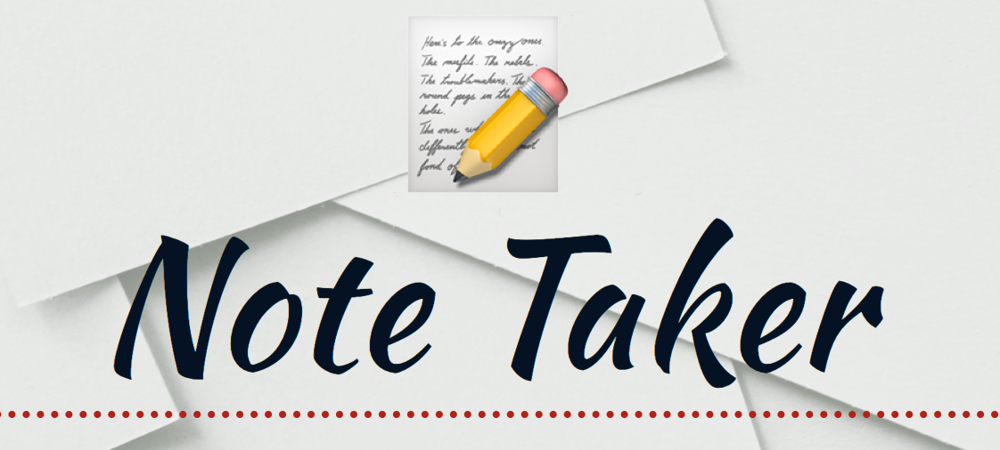

<h1 align="center"></h1>

  

## Description

You can type a title and the note that you would like to keep as a reminder and save it, and since this is done in a server side it will save accross platforms, where you can open at any time in a phone, tablet or computer and your notes will be there saved waiting for you.

## Contents 
**[Installation](#Installation)** 
**[Usage](#Usage)** 
**[License](#License)** 
**[Contact](#Contact)** 

## **Installation** 
`npm install express`

## **Usage** 
To save notes to be read later.

## **License** 
mit

## **Contact** 
vjeuel@gmail.com 

